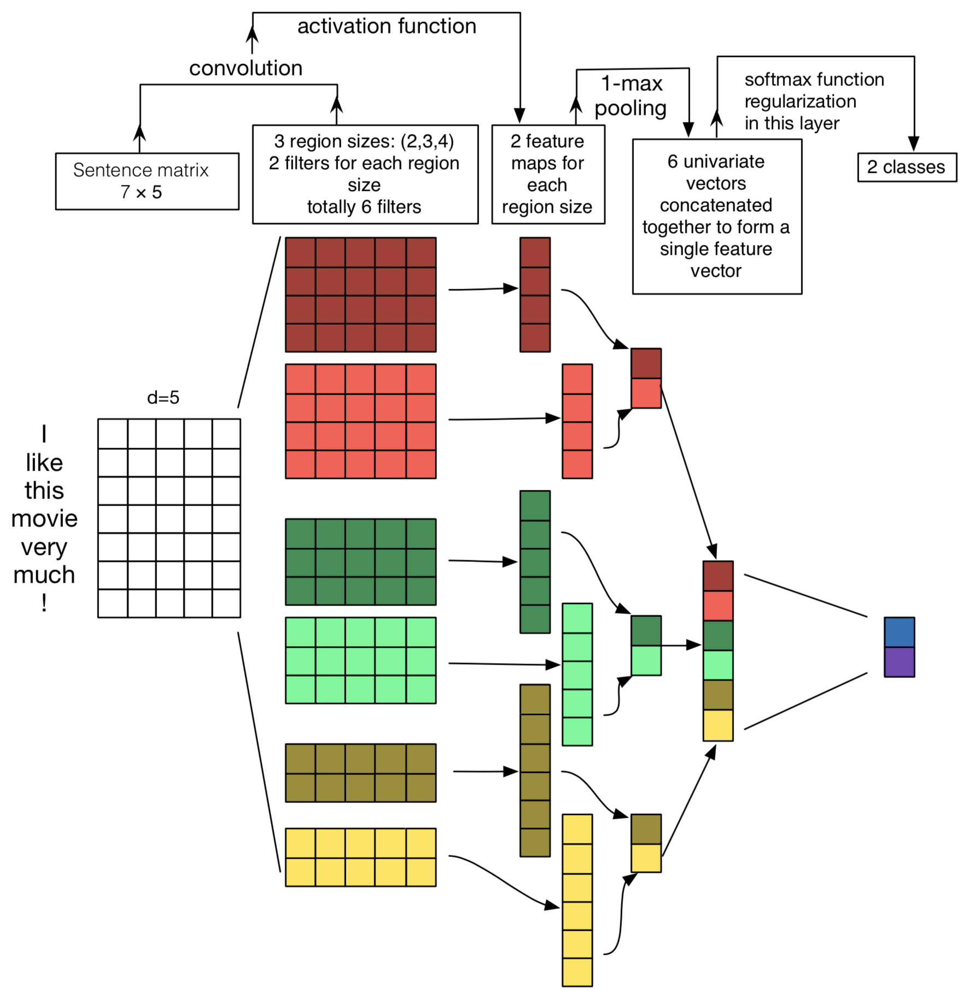

# TextCNN

With adaptive number and size of filters.

- [`text_to_embedding.ipynb`](https://github.com/idorce/textcnn_spam_filter/blob/master/text_to_embedding.ipynb): Convert text to word embeddings.
- [`textcnn.ipynb`](https://github.com/idorce/textcnn_spam_filter/blob/master/textcnn.ipynb): Model selection, predictions and all others stuff.
- `labelled.txt.zip`: Labelled Chinese texts, spam for 1 or normal for 0.

Key part:

```python
def text_cnn(region_sizes):
    """Recieve a list of region sizes, which can contain 0."""
    i = Input(shape=(Tx,), name='Sentence')
    X = Embedding(*e_mat.shape, embeddings_initializer=Constant(e_mat),
                  trainable=True, name='WordVec')(i)
    Xs = []
    region_sizes = [s for s in region_sizes if s > 0]
    for region_size in region_sizes:
        Xi = Conv1D(1, region_size)(X)
        Xi = LeakyReLU(0.1)(Xi)
        Xi = MaxPooling1D(Xi.shape.as_list()[1])(Xi)
        Xs.append(Xi)
    X = Concatenate()(Xs) if len(region_sizes) > 1 else Xs[0]
    X = Flatten()(X)
    X = Dropout(0.5, seed=seed)(X)
    X = Dense(1, activation='sigmoid')(X)
    return Model(inputs=i, outputs=X)

# Examples.
text_cnn([7, 0])
text_cnn([3, 4, 0, 0])
```

Inspired by [Kim (2014)](https://www.aclweb.org/anthology/D14-1181) and [Zhang et al. (2015)](https://arxiv.org/abs/1510.03820).


